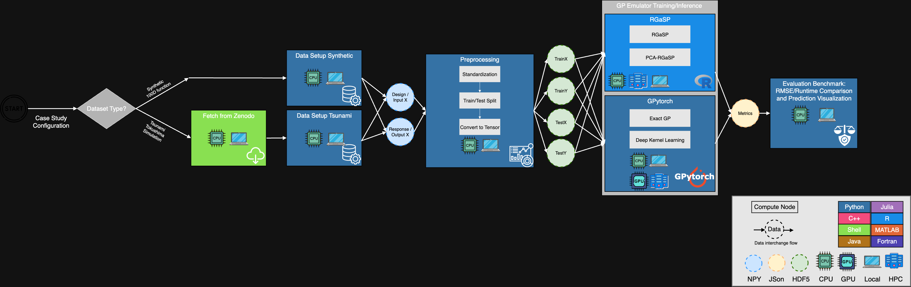

# Evaluation Pipeline for Gaussian Process Emulators with High-dimensional Dataset

Gaussian Processes (GPs) are suffering from the "curse of the dimensionality". As input or output dimension grows up, the computation becomes intractable. This project aims to explore the state-of-the-art research of dimensionality reduction in Gaussian Process emulation. In this repository, a workflow using **Snakemake** (a orchestrated workflow management framework) is constructed to facilitate benchmarking different Gaussian Process models on high-dimensional input/output problems with minimal efforts.

## Table of Contents

- [Workflow](#workflow)
- [Datasets](#datasets)
- [Prerequisites](#prerequisites)
- [Quick Start](#quick-start)
- [Folder Structure](#folder-structure)
- [Usage](#usage)
  - [Configuration](#configuration)
  - [GPU Acceleration](#gpu-acceleration)
  - [SLURM Cluster Execution](#slurm-cluster-execution)
- [Snakemake Built-in Benchmarking Features](#snakemake-built-in-benchmarking-features)
- [Advantage of using Snakemake](#advantage-of-using-snakemake)
  - [Language-Agnostic Design](#1-language-agnostic-design)
  - [CI-managed Reproducible Environments](#2-ci-managed-reproducible-environments)
- [Comparison between Nextflow and Snakemake](#comparison-between-nextflow-and-snakemake)

## Workflow



The pipeline follows a 4-step workflow:

1. **Data Setup**: Generate synthetic data or fetch and process real-world data using specialized modules
2. **Preprocessing**: Standardize, split, and save data in **HDF5 format** (language-agnostic)
3. **Model Evaluation**: Train and evaluate **GP models in parallel**:

   **High-dimensional input models:**
   - ExactGP (Python/GPyTorch)
   - DKL (Python/GPyTorch)
   - RGaSP (R/RobustGaSP)
   - PCA-RGaSP (R/RobustGaSP + PCA)

   **High-dimensional output models:**
   - PPGaSP, PCA-PPGaSP, kPCA-PPGaSP (R/RobustGaSP)
   - AE-PPGaSP, VAE-PPGaSP (PyTorch + R/RobustGaSP)
   - BiGP, PCA-BiGP, MTGP (Python/GPyTorch)

4. **Benchmark Metrics**: Compare model performance and save results

## Datasets

| Name                         | Source                                                                                                                                                                     | Problem         | Description                                                                                                                   |
| ---------------------------- | -------------------------------------------------------------------------------------------------------------------------------------------------------------------------- | --------------- | ----------------------------------------------------------------------------------------------------------------------------- |
| `synthetic_100d_function`    | Generated by 100D function                                                                                                                                                 | High-dim input  | [100D synthetic test function](https://uqworld.org/t/benchmark-case-100d-function/3732)                                       |
| `tsunami_tokushima`          | Zenodo                                                                                                                                                                     | High-dim input  | [Tsunami inundation surrogate model](https://zenodo.org/records/15093228)                                                     |
| `environment_spill_function` | Generated by Environment spill function                                                                                                                                    | High-dim output | [Environmental model function](https://www.sfu.ca/~ssurjano/environ.html)                                                     |
| `acheron`                    | [Figshare](https://figshare.com/articles/dataset/Acheron_rock_avalanche/20449410) + [GitHub](https://github.com/yildizanil/frontiers_yildizetal/tree/main)                 | High-dim output | [Acheron rock avalanche](https://www.frontiersin.org/journals/earth-science/articles/10.3389/feart.2022.1032438/full)         |
| `synthetic_landslide`        | [Figshare](https://figshare.com/articles/dataset/Synthetic_case_-_Point_estimate_method/20454924) + [GitHub](https://github.com/yildizanil/frontiers_yildizetal/tree/main) | High-dim output | [Synthetic landslide simulation](https://www.frontiersin.org/journals/earth-science/articles/10.3389/feart.2022.1032438/full) |

## Prerequisites

1. **Conda Environment Manager**:
   - [**conda**](https://www.anaconda.com/docs/getting-started/miniconda/install) or [**micromamba**](https://mamba.readthedocs.io/en/latest/installation/micromamba-installation.html)
   - [**conda-lock**](https://conda.github.io/conda-lock/getting_started/#__tabbed_1_2)

2. [**Snakemake**](https://snakemake.readthedocs.io/en/stable/getting_started/installation.html) (>= 8.0)

   ```bash
   conda install -c conda-forge -c bioconda snakemake
   ```

   Or with pip:

   ```bash
   pip install snakemake
   ```

> [!NOTE]
> If SLURM cluster execution is needed, follows the additional installation of [**SLURM executor plugin**]():
>
> ```bash
>    mamba install -c conda-forge -c bioconda snakemake-executor-plugin-slurm
> ```
>
> Or with pip:
>
> ```bash
> pip install snakemake-executor-plugin-slurm
> ```

## Quick Start

1. Clone repository:

   ```bash
   git clone https://github.com/gary8564/gpe_bench_smk.git
   cd snakemake_demo
   ```

2. Run the default pipeline (synthetic 100D function, local):
   ```bash
   snakemake --profile profiles/local
   ```

## Folder Structure

```
.
├── Snakefile                    # Main workflow orchestration
├── config.yaml                  # All configurable parameters
├── pyproject.toml               # Python package definition (src/high_dim_gp)
├── rules/                       # Modular Snakemake rules
│   ├── config.smk               # Shared config variables, paths, model selection
│   ├── utils.smk                # Reusable helpers (conda_env, gpu_env, device_flag, etc.)
│   ├── data_fetching.smk        # Data fetch command generators (Zenodo/Figshare/GitHub)
│   ├── benchmark.smk            # Performance comparison and reporting
│   ├── high_dim_input.smk       # Hub: includes all high-dim input step files
│   ├── high_dim_input/          # Per-step rules
│   ├── high_dim_output.smk      # Hub: includes all high-dim output step files
│   └── high_dim_output/         # Per-step rules
├── envs/                        # Per-rule Conda environment specifications
├── scripts/                     # Implementation scripts (Python & R)
│   ├── benchmark_metrics.py
│   ├── high_dim_input/
│   └── high_dim_output/
├── src/                         # Shared Python package (high_dim_gp)
│   └── high_dim_gp/
├── profiles/                    # Snakemake execution profiles
│   ├── local/config.yaml
│   └── slurm/config.yaml
```

## Usage

### Configuration

All parameters are defined in `config.yaml`:

```yaml
outdir: results
use_gpu: false
case_study:
  name: synthetic_100d_function # which case study to run
  problem_type: high_dim_input # high_dim_input | high_dim_output
```

For high-dimensional output problems, additional parameters are required:

```yaml
case_study:
  name: environment_spill_function
  problem_type: high_dim_output
  qoi: cmax # quantity of interest: hmax, vmax, or cmax
  preprocessing:
    threshold: 5e-06 # zero-truncation threshold
  dim_reduction:
    n_components: 10 # PCA/kPCA components
    latent_dim: 10 # AE/VAE latent dimension
```

Optionally, snakemake allows overriding config values at the command line:

```bash
snakemake --profile profiles/local \
  --config case_study="{'name': 'tsunami_tokushima', 'problem_type': 'high_dim_input'}"
```

If you want to extend to use your own datasets, extend the `datasets` section in `config.yaml`:

```yaml
datasets:
  my_new_study:
    source: "zenodo"
    description: "Description of your dataset"
    doi: "10.5281/zenodo.XXXXXXX"
    base_url: "https://zenodo.org/records/XXXXXXX"
    files:
      - "data_file1.csv"
      - "data_file2.zip"
```

### GPU Acceleration

Set `use_gpu: true` in `config.yaml`. This selects CUDA-enabled Conda
environments for GPU-capable models (ExactGP, DKL, BiGP, MTGP, AE/VAE-PPGaSP).

### SLURM Cluster Execution

```bash
snakemake --profile profiles/slurm
```

## Snakemake Built-in Benchmarking Features

Each model evaluation rule uses Snakemake's [`benchmark`](https://snakemake.readthedocs.io/en/stable/tutorial/additional_features.html#benchmarking)
directive to automatically capture wall clock time, CPU time, and peak memory
usage. After a run, TSV files are written to:

```
results/<case_study>/benchmarks/
├── evaluate_exactgp.tsv        # high-dim input models
├── evaluate_dkl.tsv
├── evaluate_rgasp.tsv
├── evaluate_pca_rgasp.tsv
├── evaluate_ppgasp.tsv         # high-dim output models
├── evaluate_bigp.tsv
├── evaluate_mtgp.tsv
├── ...
```

## Advantage of using Snakemake:

### 1. Language-Agnostic Design

This workflow demonstrates **programming language agnosticism** in scientific computing pipelines by using **HDF5** as cross-language scientific data format so that the data can flow through different stages which might use different OS platform / programming languages / container images.

### 2. CI-managed Reproducible Environments

- **Per-process environment isolation:** Each Snakemake process can define its own Conda environment in `envs/`, allowing Python/GPyTorch, R/RobustGaSP, and other model-specific dependencies to remain isolated while still being orchestrated in one benchmark pipeline. This follows the SHOWME.how isolation principle: every computational unit should carry an explicit environment specification rather than relying on a manually configured local setup.

- **CI-generated lock/pin files:** The repository can use CI to regenerate platform-specific explicit Conda specifications whenever `envs/*.yml` changes. In Snakemake, these are stored as `envs/<name>.<platform>.pin.txt` beside the YAML files. This makes execution more reproducible.

## Comparison between Nextflow and Snakemake

Same benchmark example is used in [gpe_bench_nxf](https://github.com/gary8564/gpe_bench_nxf) repo to demonstrate and compare how snakemake and nextflow work.

| Aspect             | Nextflow                              | Snakemake                                                                       |
| ------------------ | ------------------------------------- | ------------------------------------------------------------------------------- |
| Workflow language  | Groovy DSL                            | Python-based                                                                    |
| Paradigm           | Channel-based (push; top-down)        | File-based DAG (pull; bottom-up)                                                |
| Config             | `.config`                             | `.yaml`                                                                         |
| Modules            | `modules/*.nf` (one process per file) | `rules/high_dim_input/*.smk`, `rules/high_dim_output/*.smk` (one rule per file) |
| Intermediate files | Hidden in `work/` directory           | Visible in output directory                                                     |

## Reference

1. Mölder F, Jablonski KP, Letcher B et al. Sustainable data analysis with Snakemake [version 1; peer review: 1 approved, 1 approved with reservations]. F1000Research 2021, 10:33 (https://doi.org/10.12688/f1000research.29032.1)
2. Henri E. Bal, Jennifer G. Steiner, and Andrew S. Tanenbaum. 1989. Programming languages for distributed computing systems. ACM Comput. Surv. 21, 3 (Sep. 1989), 261–322. https://doi.org/10.1145/72551.72552
